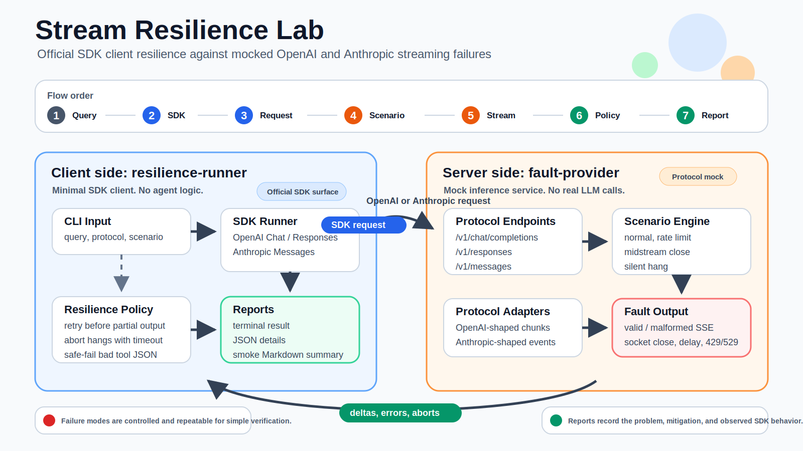

# Stream Resilience Lab

Lightweight TypeScript harness for testing client resilience against mocked LLM streaming failures.

The project has two intentionally named sides:

- `fault-provider`: a local OpenAI/Anthropic-compatible mock inference service that creates controlled failures.
- `resilience-runner`: a SDK-based client that calls the fault provider, applies resilience behavior, and records what happened.

## How It Works



`fault-provider` never calls a real model. It exposes provider-compatible endpoints, chooses a scenario such as `midstream-close` or `half-tool-json`, then emits valid JSON, valid SSE, malformed SSE, delayed streams, rate limits, or socket closes.

`resilience-runner` behaves like a minimal SDK client. It sends the query through the official SDK, observes how the SDK surfaces each failure, applies bounded retry or safe-failure rules, preserves partial output when available, and writes a report describing the problem and mitigation.

## Install

```bash
npm install
```

## Start Fault Provider

```bash
npm run fault-provider
```

The server listens at:

```text
http://127.0.0.1:3000/v1
```

## Run One Resilience Scenario

Recommended no-warning form:

```bash
npm run resilience-runner -- openai-chat "hello" midstream-close 3000
npm run resilience-runner -- openai-responses "hello" rate-limit-retry-after 3000
npm run resilience-runner -- anthropic "hello" half-tool-json 3000
```

Explicit flag form:

```bash
npm run resilience-runner -- openai-chat "hello" -- --stream --scenario midstream-close --wall-timeout-ms 3000
```

## List Scenarios

```bash
npm run resilience:scenarios
```

## Run Smoke Matrix

```bash
npm run resilience:smoke
```

Reports are written to `reports/`.

Compatibility aliases are also available: `npm run server`, `npm run client`, `npm run scenarios`, and `npm run smoke`.

## Protocols

- OpenAI Chat Completions: `POST /v1/chat/completions`
- OpenAI Responses: `POST /v1/responses`
- Anthropic Messages: `POST /v1/messages`

## Resilience Behaviors

- Retry before partial output.
- Track visible partial output from SDK stream errors when the SDK exposes it.
- Suppress automatic retry after visible partial output.
- Abort hanging streams with an SDK abort signal.
- Block incomplete or unobservable tool-call JSON in `half-tool-json` scenarios.
- Write structured JSON reports and smoke Markdown summaries.

## Useful Scenarios

- `normal`: valid response or valid stream.
- `rate-limit-retry-after`: 429 before first token.
- `overloaded-retry-after`: 529 before first token.
- `midstream-close`: partial text, then socket close.
- `half-sse-frame`: incomplete SSE frame, then close.
- `silent-hang`: open stream with no useful deltas.
- `half-tool-json`: incomplete tool-call JSON; client must fail safely.
