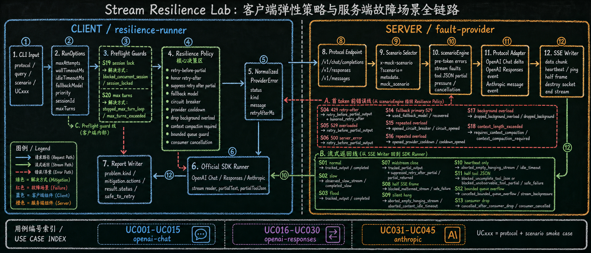

# Stream Resilience Lab

Lightweight TypeScript harness for testing SDK client resilience against mocked LLM streaming failures.

The project has two intentionally named sides:

- `fault-provider`: a local OpenAI/Anthropic-compatible mock inference service that creates controlled failures.
- `resilience-runner`: an SDK-based client that calls the fault provider, applies resilience behavior, and emits a timestamped trace of what happened.

## How It Works



`fault-provider` never calls a real model. It exposes provider-compatible endpoints, chooses a scenario such as `midstream-close` or `half-tool-json`, then emits valid JSON, valid SSE, malformed SSE, delayed streams, rate limits, overloads, client-side cancellation exercises, or socket closes.

`resilience-runner` behaves like a minimal SDK client. It sends the query through the official SDK, observes how the SDK surfaces each failure, applies bounded retry or safe-failure rules, preserves partial output only when safe, and emits structured trace events. The same trace stream powers the CLI output and the desktop debugger.

The canonical Chinese guide is in [`docs/streaming-resilience.zh-CN.md`](docs/streaming-resilience.zh-CN.md). It contains the request/response flow, the `S01`-`S20` scenario catalog, the stable `UC001`-`UC045` quick smoke matrix, and the `FUC001`-`FUC060` full smoke matrix.

## Install

```bash
npm install
```

## Desktop Debugger

```bash
npm run desktop
```

The desktop app starts a visual debug surface for running scenarios. It shows a two-lane timeline: server events on one side, client events on the other, with correlated session/request/attempt ids so you can see when each side handled an event and what it did.


### Build for Distribution

```bash
# Build for current platform
npm run desktop:dist

# Build for all platforms (Windows, macOS, Linux)
npm run desktop:dist:all

# Build for specific platform
npm run desktop:dist:win    # Windows NSIS installer
npm run desktop:dist:mac    # macOS DMG image
npm run desktop:dist:linux  # Linux AppImage + deb
```

Builds platform-specific installers in `dist/packages/`:

- **Windows**: NSIS installer (`.exe`)
- **macOS**: DMG image (`.dmg`)
- **Linux**: AppImage (`.AppImage`) + Debian package (`.deb`)

The build bundles the renderer, main process, preload, and fault-provider server so the packaged app runs standalone without external dependencies.

**CI/CD**: This project includes GitHub Actions workflows for automated multi-platform builds. Push a version tag (e.g., `v1.0.0`) to trigger automatic builds on all platforms and create a GitHub Release. See [`docs/github-actions-guide.md`](docs/github-actions-guide.md) for details.

**Note**: Cross-platform building from Windows has limitations. See [`docs/cross-platform-build.md`](docs/cross-platform-build.md) for local build details and troubleshooting.

## Start Fault Provider

```bash
npm run fault-provider
```

The server listens at:

```text
http://127.0.0.1:3000/v1
```

## Run One Resilience Scenario

Recommended no-warning form:

```bash
npm run resilience-runner -- openai-chat "hello" midstream-close 3000
npm run resilience-runner -- openai-responses "hello" rate-limit-retry-after 3000
npm run resilience-runner -- anthropic "hello" half-tool-json 3000
```

Explicit flag form:

```bash
npm run resilience-runner -- openai-chat "hello" -- --stream --scenario midstream-close --wall-timeout-ms 3000
```

Stream-only scenarios reject `--no-stream`; JSON mode is only valid for scenarios that have non-stream behavior.

## List Scenarios

```bash
npm run resilience:scenarios
```

The list prints injected problem, expected final problem, and expected final status separately.

## Run Smoke Matrices

Quick smoke keeps the stable historical use-case IDs:

```bash
npm run resilience:smoke
```

- `UC001`-`UC015`: `openai-chat`
- `UC016`-`UC030`: `openai-responses`
- `UC031`-`UC045`: `anthropic`

Full smoke covers all 20 scenarios across all 3 protocols:

```bash
npm run resilience:smoke:full
```

- `FUC001`-`FUC020`: `openai-chat`
- `FUC021`-`FUC040`: `openai-responses`
- `FUC041`-`FUC060`: `anthropic`

Trace events and final outcomes include the use-case id when the run came from a smoke matrix or when `--use-case-id <id>` is passed.

Compatibility aliases are also available: `npm run server`, `npm run client`, `npm run scenarios`, `npm run smoke`, and `npm run smoke:full`.

## Protocols

- OpenAI Chat Completions: `POST /v1/chat/completions`
- OpenAI Responses: `POST /v1/responses`
- Anthropic Messages: `POST /v1/messages`

## Resilience Behaviors

- Retry before partial output.
- Honor `retry-after` / `retry-after-ms` when SDK errors expose headers.
- Track visible partial output from SDK stream errors when the SDK exposes it.
- Suppress automatic retry after visible partial output.
- Abort hanging streams with reasoned wall/idle timeout signals; `idleTimeoutMs` is the per-chunk idle budget reset by stream progress, while `wallTimeoutMs` is the total attempt hard cap.
- Block incomplete or unobservable tool-call JSON in `half-tool-json` scenarios.
- Enforce bounded stream event budgets inside SDK runners and fail safely before returning partial output.
- Simulate downstream consumer cancellation from the client side instead of treating it as provider socket failure.
- Recover through a fallback model before any partial output is visible.
- Open circuit-breaker and provider cooldown states, then block later requests for the same provider key.
- Drop overloaded background work instead of retrying low-priority tasks.
- Require context compaction for context overflow instead of retrying.
- Guard same-session concurrency and max-turn loops before calling the provider.
- Emit structured server/client trace events for CLI output and desktop inspection.

## Scenario Catalog

Scenario IDs are stable documentation handles. The canonical source of names is `src/shared/scenarios.ts`.

| ID | Scenario | Injected problem | Expected final status | Client mitigation focus |
|---|---|---|---|---|
| `S01` | `normal` | `none` | `completed` | Track completed output |
| `S02` | `slow` | `none` | `completed_slow` | Complete slow stream when per-chunk idle and total wall budgets both hold |
| `S03` | `rate-limit-retry-after` | `rate_limited` | `exhausted` | Retry before partial output; honor retry-after |
| `S04` | `overloaded-retry-after` | `overloaded` | `exhausted` | Retry before partial output; honor retry-after |
| `S05` | `server-error` | `server_error` | `exhausted` | Retry before partial output |
| `S06` | `midstream-close` | `stream_interrupted` | `partial_returned` | Return partial output; suppress retry |
| `S07` | `half-sse-frame` | `malformed_stream` | `safe_failure` | Block malformed stream |
| `S08` | `silent-hang` | `idle_timeout` | `aborted_idle_timeout` | Abort empty hanging stream |
| `S09` | `heartbeat-only` | `idle_timeout` | `aborted_idle_timeout` | Treat heartbeat-only as no useful content |
| `S10` | `half-tool-json` | `unsafe_partial_tool_call` | `safe_failure` | Block incomplete tool JSON |
| `S11` | `flood` | `none` | `completed` | Consume high-volume chunks |
| `S12` | `bounded-queue-overflow` | `stream_backpressure` | `safe_failure` | Cancel once the stream event budget is exceeded |
| `S13` | `consumer-drop` | `consumer_cancelled` | `consumer_cancelled` | Cancel after downstream consumer drop |
| `S14` | `fallback-recovery` | `overloaded` | `recovered` | Recover through fallback model |
| `S15` | `circuit-breaker-open` | `overloaded` | `circuit_opened` | Open circuit breaker |
| `S16` | `provider-cooldown` | `overloaded` | `cooldown_opened` | Open provider cooldown |
| `S17` | `background-overloaded` | `overloaded` | `dropped_background` | Drop overloaded background work |
| `S18` | `context-overflow` | `context_overflow` | `context_compaction_required` | Require context compaction |
| `S19` | `session-lock-conflict` | `session_lock_conflict` | `session_locked` | Block concurrent same-session work |
| `S20` | `max-turns-exceeded` | `max_turns_exceeded` | `max_turns_exceeded` | Stop max-turn loop before provider call |
